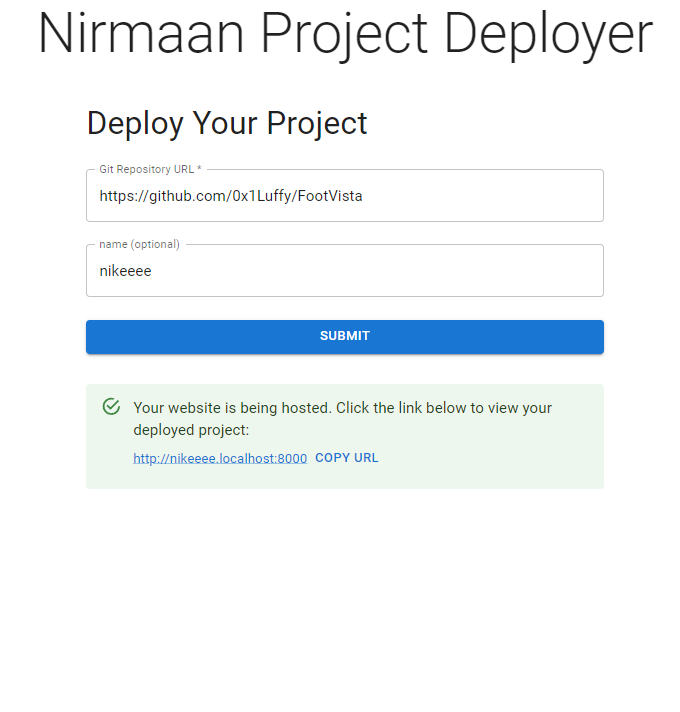
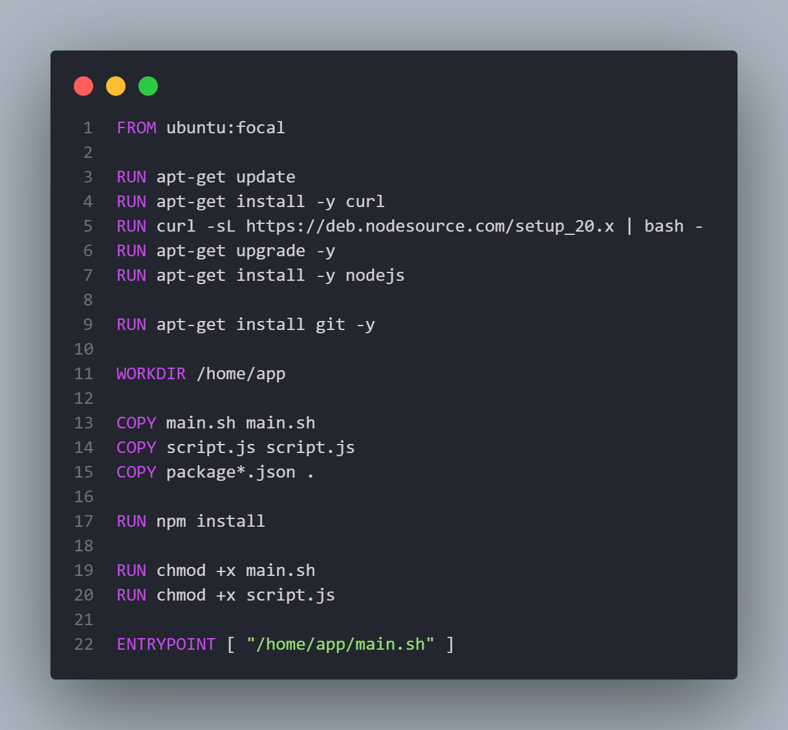
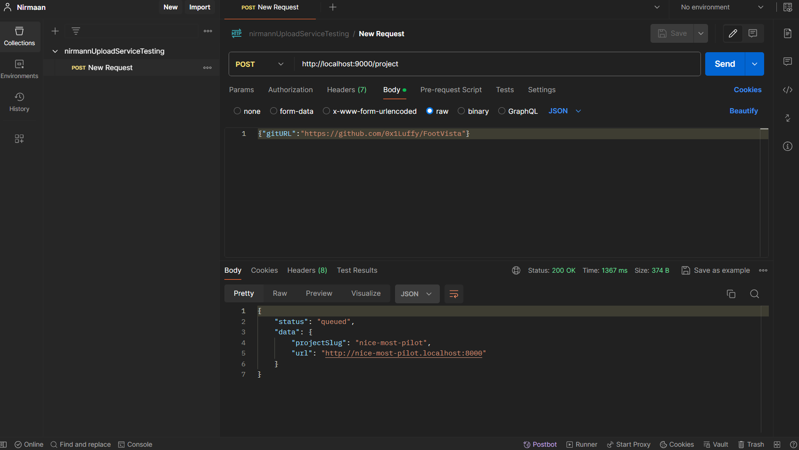

# Nirmaan


Nirmaan allows you to deploy your website using a GitHub repository. It utilizes Docker, Redis, S3, ECR, and ECS for a robust and scalable deployment infrastructure.

## Project Structure

### 1. Build Server

This folder contains the setup for building and deploying the project.

- **Dockerfile**: Sets up the environment with necessary dependencies such as Node.js and Git. It copies the required scripts and sets the entry point to `main.sh`.
  

- **main.sh**: Clones the GitHub repository specified by `GIT_REPOSITORY_URL` and executes `script.js`.

- **script.js**: Handles the build process by running npm commands to install dependencies and build the project. It then uploads the build output to an S3 bucket.

### 2. S3 Reverse Proxy

This folder contains the reverse proxy setup to serve files from the S3 bucket.

- **index.js**: Uses Express and `http-proxy` to serve the files stored in the S3 bucket. It dynamically routes requests based on the subdomain and serves the `index.html` file if no specific file is requested.

### 3. API Server



This folder contains the API server that orchestrates the deployment process.

- **server.js**: Sets up an Express server that listens for POST requests to create a new project. It triggers an ECS task that runs the build server container with the specified GitHub repository URL. Once the build is complete, it provides a URL to access the deployed site via the reverse proxy.

### 4. Frontend

This folder contains the React application for interacting with the API server.

- **src/ProjectForm.js**: A React component for submitting a GitHub repository URL and optionally a slug. It sends this data to the API server and displays the deployment URL.
- **src/App.js**: The main React component that includes `ProjectForm` and sets up the Material-UI theme for a beautiful UI.
- **src/index.js**: The entry point for the React application.
- **public/index.html**: The HTML file that contains a div with an id of `root`. This is where the React application is injected.

#### How to Run the Frontend

1. Navigate to the `frontend` directory:
   ```bash
   cd frontend
   ```
2. Install dependencies:
   ```bash
   npm install
   ```
3. Start the React application:
   ```bash
   npm start
   ```
4. Open your browser and go to `http://localhost:3000` to interact with the application.

## How It Works

1. **User submits a GitHub repository URL**: The API server receives this URL and generates a unique project slug.
2. **Trigger ECS task**: The API server sends a command to ECS to run the build server container, passing the GitHub URL and project slug as environment variables.
3. **Build process**: The build server clones the repository, installs dependencies, builds the project, and uploads the output to the S3 bucket.
4. **Serve the site**: The S3 reverse proxy serves the built site, making it accessible via a URL that includes the project slug.

Nirmaan integrates Docker for containerization, ECS for orchestration, S3 for storage, and a reverse proxy to serve the built websites seamlessly. This setup ensures a scalable and efficient deployment pipeline for web applications.

## Tech Stack

- **Docker**: Containerization of the build server for consistent and reproducible builds.
- **Node.js**: Server-side JavaScript environment used in both the build server and reverse proxy.
- **Express**: Web framework for Node.js used to create the API server and reverse proxy server.
- **AWS ECS (Elastic Container Service)**: Orchestrates the Docker containers to manage the build process.
- **AWS S3 (Simple Storage Service)**: Stores the build outputs and serves static files.
- **AWS ECR (Elastic Container Registry)**: Stores Docker images for deployment.
- **http-proxy**: Middleware to handle reverse proxying of requests to the correct S3 locations.
- **random-word-slugs**: Utility for generating unique project slugs.
- **React**: Frontend library for building the user interface.
- **Material-UI**: React component library for a beautiful and consistent UI design.

With these technologies, Nirmaan offers a comprehensive and efficient solution for deploying web applications directly from GitHub repositories.

## How to Clone

To clone the repository, run the following command:

```bash
git clone https://github.com/Samueal07/nirmaan.git
```
